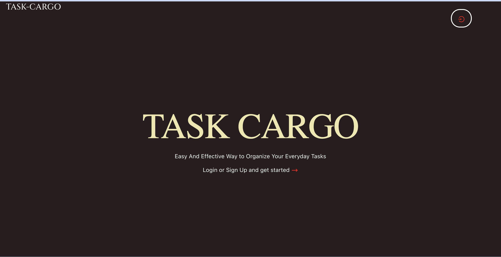

## TASK-CARGO

## Description
Welcome to **TaskCargo**.  
With this todo app, you can keep track of all your tasks and stay organized throughout your day. Simply add your tasks to the app and mark them as complete when you've finished them. You can also categorize your tasks by project, priority level, or any other custom tags you choose. With a user-friendly interface and simple design, this app makes it easy to stay on top of your to-do list and increase your productivity.
   Enjoy the experience Cheers!

## Screenshot

## Development Technologies
- Visual StudioCode.
- Live server extension.

## Development Installattion
To get the code .

## project Set-up
### Option 1 (live link)
If you want to see the app running in real-time directly, you can just click on this [link](https://task-cargo.vercel.app/):
`https://task-cargo.vercel.app/`

### Option 2 (Cloning the repository)
1. Cloning the repository:
press git clone `git@github.com:kimathinjoki/TaskCargo.git` on your terminal
2. Move to the folder and install requirements
3. `client`
4. Open the directory with your preferd application(prefereably VScode)
5. Make sure you `install npm` for the required dependancies to be added.
6. Open the application on your prefered browser.
7. Run `npm start` to view the app in your prefered browser.

## Running the Application and Features
### User Story
- This Application works with fetched data  from a remote server. 
- The first thing you will notice when you load the page is the login page where you need to either login if you have an account or signup if not. 
- Once you create an account you will be able to see what tasks you have pending and their details.
- You are able to add a task on the top section where they will be displayed  on the home page.
- You can edit or delete a task at your preference.
 

# THERE YOU GO! YOU CAN NOW ACTIVELY ENGAGE WITH THE APPLICATION. HAVE FUN!

## Technology Used
* React
* JSON server
* Npm dependencies

## Lincense
Mozilla Public License Version 2.0

## Author
This repository is maintained by:

- [Kimathi Njkoki](https://github.com/kimathinjoki) 